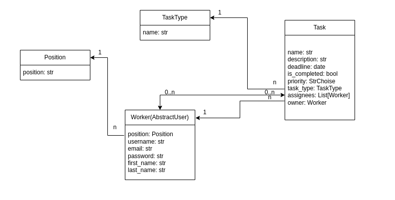
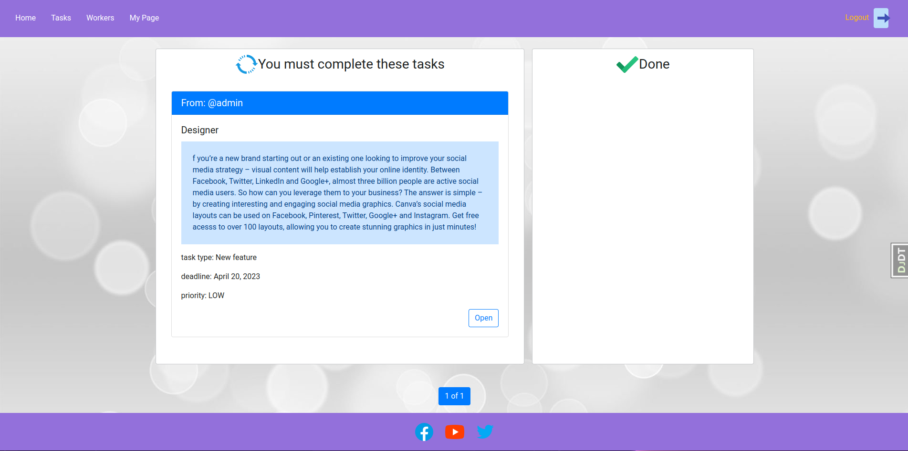

# It-company-task-manager

Project manager that involves task management for specialists: creating, updating, and deleting tasks.

## Features
* Unregistered user does not have access to view website pages.
* Registered user has access to create, update, and delete tasks.
* User has access to update and delete only those tasks that belong to them.
* User can assign other users to perform their task.
* User can choose not to assign anyone to perform the task if User are not sure who can do it, and let the users decide for themselves.
* The user who is performing the task must keep track of the deadlines, as they will not be able to mark the task as completed if it is overdue.
* Users can update their information and also delete their accounts.
* Users can use the search form located in the site navigation panel.

## DB-structure




## Home-page example




## Installation

Python3 must be already installed

```shell
git https://github.com/evgenijmartynuk07/it-company-task-manager
cd it_company
python -m venv venv
Windows: venv\Scripts\activate
Linux, Unix: source venv/bin/activate
pip install -r requirements.txt
python manage.py runserver
```


## Link to the Project

[It company task manager project deployed to Render](https://it-manager-project.onrender.com/)

You may use such credentials:

Username: usertest

Password: user12345
